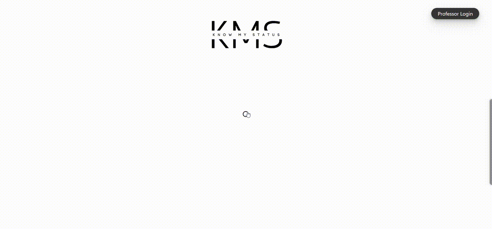

<div align="center">
  <h1 align="center">KMS - Know My Status</h1>
  <h3>QR-Enabled Teacher Status Monitoring System</h3>

</div>

<div align="center">
  <a href="https://kmsknowmystatus.000webhostapp.com/">Know My Status</a>
</div>

<br/>

Know My Status is QR-Enabled Teacher Status Monitoring System 

## Features

- **Sharable QR:** Share your QR and update on KMS portal for real-time update.
- **Real Time Updation:** Add your preference time.
- **Custom Status - Feature:** Apart from available options, there is Custom Status to update and reflect.
- **Self-hosted, open-source:** Host it yourself and hack on it

## Intro


## Demo



## Getting Started

### Prerequisites

Here's what you need to be able to run KMS:

- PHP
- PostgreSQL Database / MYSQL
- webHOST server - 000
- Resend - For Sending Mail (Soon)

### 1. Clone the repository

```shell
git clone
cd KnowMyStatus-KMS
```

### 2. Initialize the database

```shell
Open your MySQL dashboard.

CREATE TABLE `user_form` (
`id` int(255) NOT NULL,
`name` varchar(255) NOT NULL,
`email` varchar(255) NOT NULL,
`password` varchar(255) NOT NULL,
`user_type` varchar(255) NOT NULL DEFAULT 'user',
`updatestatus` varchar(255) NOT NULL
) ENGINE=InnoDB DEFAULT CHARSET=utf8mb4 COLLATE=utf8mb4_general_ci;
```

### 3. Run the server

```shell
using Apache and SQL 
```

### 4. Open the app in your browser


### Thank you so much.

